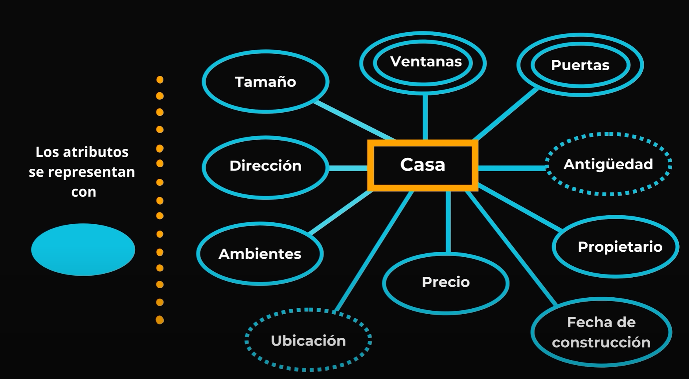
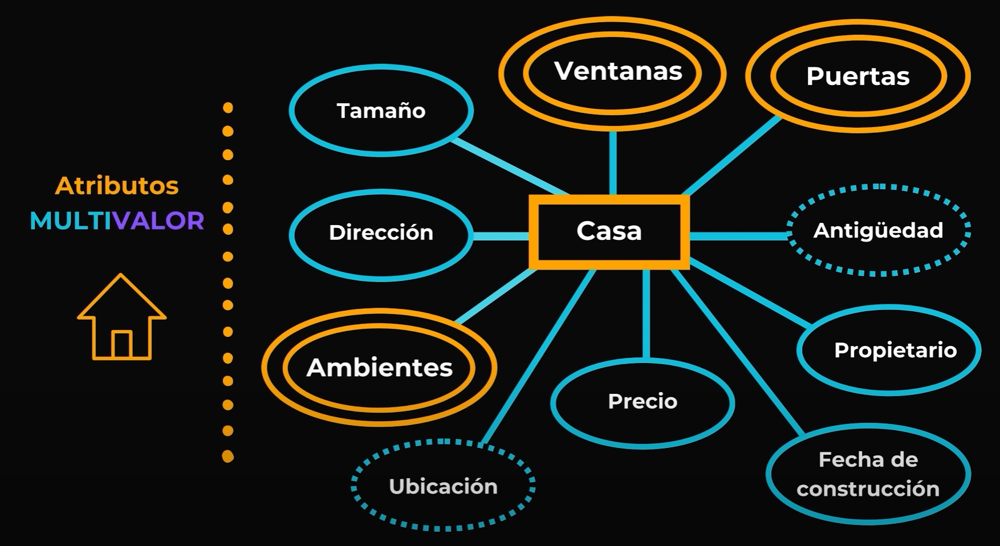
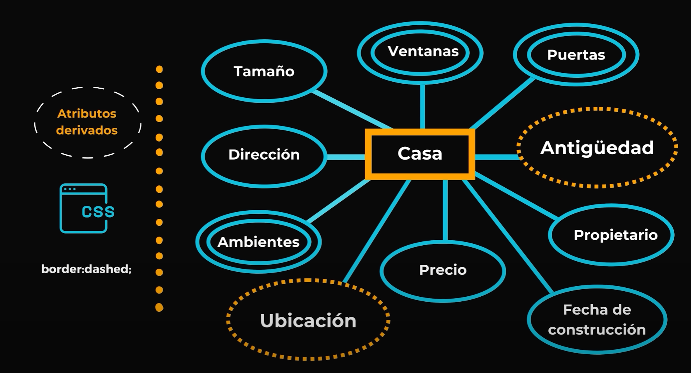
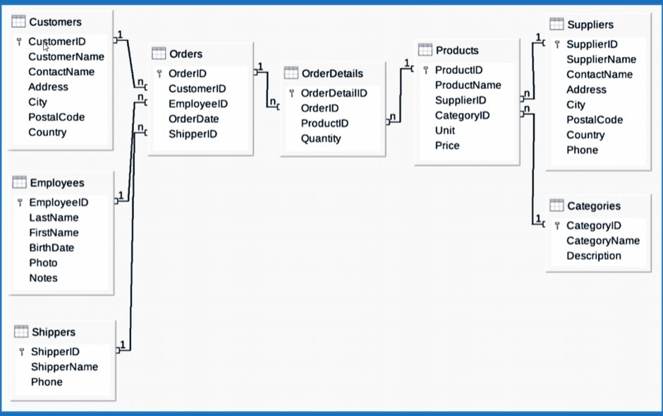

# SQL

*Informacion y notaciones de SQL*

## Modelo ER (CHEN)

### Entidad

Es una representación de algo por ejemplo una persona; la entidad de una persona representa lo que seria una persona pero hablando de forma abstracta.

En una tienda online la base de datos podría tener diferentes entidades como:

- Clientes
- Productos
- Órdenes de compra
- Proveedores

La nomenclatura que utilizamos es la **NOTACIÓN DE CHEN**.

Con esta nomenclatura podemos representar **ENTIDADES** y sus **RELACIONES**.

Utilizamos un **CUADRADO** para encerrar una **ENTIDAD**.

Una **ENTIDAD** es una entidad por sus propiedades y atributos.

Ejemplo:

**CASA**
 - Ventanas
 - Puertas
 - Direccion
 - Ubicacion
 - Etc

Estas propiedades se encierran con un **OVALO**.




---

### Atributos COMUNES

Dentro de los atributos comunes tenemos dos tipos:

### Atributos SIMPLES
 - Datos únicos (Ejemplo PRECIO DE CASA).


### Atributos COMPUESTOS
 - Ambientes (Porque se componen de otras cosas como tamaño, tipo, etc)

Su forma de representación es sacando una linea dando a entender que estan compuestos por otras propiedades:


---

### Atributos MULTIVALOR

Por ejemplo los **AMBIENTES** tienen mas de un valor, ventanas, puertas, etc.

Para su representación se les hace un **DOBLE OVALO**



---

### Atributos DERIVADOS

Se pueden obtener con cualquier otra información.

Por ejemplo podemos obtener la **ANTIGÜEDAD** de una casa por su **FECHA DE CONSTRUCCION**.

Lo obtenemos a partir de otro atributo.

Con la **UBICACION** nos pasaría lo mismo ya que la podemos obtener de la **DIRECCION** de la casa.

Los atributos derivados los representamos con un ovalo con su borde punteado.



---

### KEY

Es un valor único como si fuera una Cédula de Identidad. Por ejemplo dos gemelos son iguales pero se diferencian por su Cédula de Identidad.

Lo representamos también con un óvalo pero va subrayado.


---


## LENGUAJE

Para crear una BASE DE DATOS utilizamos **CREATE DATABASE "name"**, la alternativa facil en DB BROWSER es crearla desde la opcion *NEW DATABASE*


### TABLA

Es una estructura de datos que se organiza en filas y columnas.

- Nombre (Clientes,Personas,Productos,etc)
- Campo (Nombre de la columna vertical) FIELD
- Registro (Es la fila horizontal) RECORD
- Valor de Campo (Es el valor de cada celda) FIELD VALUE

Para hacerlo de forma manual seria **CREATE TABLE "name"**

---

### Valor de Campo

Los valores de campo tienen su tipo que puede ser INTEGER, TEXT, BLOB, REAL, NUMERIC.

Cada valor puede tener un DEFAULT y se repetira el valor siempre. Por ejemplo cuando no ingreso el valor por defecto se pondra el que establezca en DEFAULT.


---

*Con este codigo creamos la base de datos "users" con los campos de nombre, apellido y edad*

```sql
CREATE TABLE "users" (
	"nombre"	TEXT,
	"apellido"	TEXT,
	"edad"	INTEGER
);

```

En el apartado de EXECUTE SQL podemos agregar las consultas para nuestra base de datos.

---

### SELECT

Seleccionamos algo de la base de datos con este codigo.

Por ejemplo con el asterisco (*) podemos seleccionar todo.

Seguido de la propiedad necesitamos decir desde donde lo quiero seleccionar (FROM) y luego le decimos desde que campo.

Si queremos **SELECCIONAR TODOS LOS USUARIOS**

La consulta se veria asi:

```sql
SELECT * FROM users
```
---

### INSERT

Para insertar datos en nuestra database necesitamos hacerlo con **INSERT INTO "nombre de tabla (nombre,apellido,edad)"**.

Dentro del parentesis luego del nombre de la tabla ingresamos los campos que queremos insertar.

*Basicamente lo que decimos en la consulta es que en la tabla users queremos insertar los campos de nombre, apellido y edad.*

Esto va acompañado de los valores.

**VALUES ('Lautaro','Zapata',23)**

```sql
INSERT INTO users (nombre,apellido,edad)
VALUES ('Lautaro','Zapata',23)
```


Si queremos hacer un insert con varios valores podemos concatenarlos con coma.

```sql
INSERT INTO users (nombre,apellido,edad)
VALUES ('Lautaro','Zapata',23),
        ('Roman','Caceres',23),
        ('Santino','Zapata',11)
```

---


**Ejemplos si queremos seleccionar uno, dos o tres campos de la base de datos y esta nos devuelve una tabla nueva para cada caso**

*Seleccionamos un campo*

```sql
SELECT nombre FROM users
```
*Seleccionamos dos campos*
```sql
SELECT nombre,apellido FROM users
```

*Seleccionamos tres campos*

```sql
SELECT nombre,apellido,edad FROM users
```
---


### DELETE

Eliminar todos los registros de la tabla usuarios.

```sql
DELETE FROM usuarios
```
---

### IDENTIFICADORES

Tenemos 2 tipos de identificadores.

Tenemos que crear un nuevo **CAMPO** con el valor de id y establecerlo como AI (AUTO INCREMENT), a su vez automaticamente se selecciona PK (PRIMARY KEY).

Con esto podemos hacer que cada valor que registremos sea unico y por mas que tenga el mismo nombre o apellido se va a diferenciar por su ID.

---

**Para separar las consultas debemos hacerlo con punto y coma (;)**


---

### Tipos de id

**Llaves Foraneas**

FK

Las Llaves Foraneas son aquellas que hacen referencia a una clave primaria de otra tabla. 

Por ejemplo si tenemos un **ID USUARIO** en una tabla de usuarios, esa clave va a ser primaria porque es unica.

Pero si tenemos otra tabla de turnos medicos y el medico tiene que poner el ID del usuario que atendió pasa a ser una Clave Foranea ya que la Clave Primaria seria el turno registrado


**Llaves Primarias**

Ejemplo ID UNICO (PK) Primary Key.

---

*Cuando vamos a crear varias tablas y algunas entidades se van a relacionar, es conveniente asignar el mismo valor en las tablas en aquella propiedad que vamos a usar*

Por ejemplo si vamos a usar un id_usuario, ponemos el mismo nombre en todas las tablas para que sea mas legible.

*Un caso de mala practica seria tener id_usuario en una tabla y en la otra tabla tener id_paciente. En este caso no seria tan legible y facilmente nos podemos confundir.*

---

### Diagrama para RELACIONAR TABLAS

*Las tablas se relacionan por las FK (Llaves Foraneas)*

---

**Northwind ER Diagram**



Podemos ver que las tablas estan conectadas por FK(Llaves Foraneas)

---

### Comulnas y Alias (AS y ORDER BY)


**AS**

Sirve para cambiar temporalmente el nombre a una columna.

Se usa principalmente para darle un nombre mas descriptivo a la tabla.

---
**ORDER BY**

Nos sirve para ordenar de forma ascendente los valores de la tabla que le pasemos.

Por defecto utiliza ASC (ascendiente) pero es buena practica ponerlo en la consulta.

``` sql
ORDER BY price ASC
```

Tambien podemos usar DESC para ordenar de forma descendiente.


Los datos NULL por defecto se muestran al inicio cuando ordenamos las tablas, para evitar esto podemos utilizar la siguiente consulta:

```sql
SELECT * FROM Products
ORDER BY ProductName ASC NULLS LAST
```

Con la sentencia NULL LAST indicamos que nos muestre los NULLS al final de la tabla.

---

**Cómo ELIMINAR datos duplicados?**

La cláusula DISTINCT nos devuelve una tabla con valores únicos por lo tanto no nos devuelve datos repetidos.

```sql
SELECT DISTINCT ProductName FROM Products
```

---

### Cláusula WHERE (condición)

Funciona para saber por ejemplo que ID esta asociado a un NOMBRE DE PRODUCTO.
Por ejemplo:

```sql
SELECT ProductName FROM Products
WHERE ProductID = 14
```

Esta consulta pide que devuelva una nueva tabla con los NOMBRES DE PRODUCTOS de la tabla PRODUCTS
pero solamente la que tenga el PRODUCT ID 14.

Funciona como un IF.

Tambien podemos pedir todo el registro completo y no solo el PRODUCTNAME

```sql
SELECT * FROM Products
WHERE ProductID = 14
```

Nos devuelve todo el registro de ese producto.

De esta forma tambien podemos buscar por nombre y no solo por ID

```sql
SELECT * FROM Products
WHERE ProductName = "Tofu"
```

Si necesitamos saber todos los productos inferiores a determinado precio podemos hacerlo tambien con la siguiente consulta.

```sql
SELECT * FROM Products
WHERE Price <= 40
```

Esto nos devuelve todos los productos con precio menor o igual a 40.

---

**COMO ELIMINAR UN REGISTRO?**

```sql
DELETE FROM turnos_medicos
WHERE id_turno = 1
```

Con esta consulta eliminamos el TURNO MEDICO con el ID 1 si es que existe.

---

**COMO MODIFICAR UN REGISTRO**

```sql
UPDATE turnos_medicos SET horario = "08:30"
WHERE id_turno = 1
```

Con esta consuta modificamos la hora del turno medico especifico que queremos cambiar, si no lo especificamos con el WHERE se cambian todos los horarios.

En la CLÁUSULA SET podemos cambiar mas de un valor separandolo con coma.

```sql
UPDATE turnos_medicos 
SET horario = "10:30", motivo = "Dolor de muela" WHERE id_turno = 1
```
---

### AND, OR Y NOT

**Operadores Logicos**

*AND*

```sql
SELECT * FROM Customers
WHERE CustomerID >= 50 AND CustomerID < 55
```

Esta consulta nos devuelve todos los ID de CUSTOMERS que esten entre 50 y 55.

*OR*

Nos sirve por si necesitamos tener dos condiciones y elegimos entre una o la otra.

```sql
SELECT * FROM Employees
WHERE FirstName = "Nancy" OR Firstname = "Anne"
```

Esta consulta nos devuelve a las dos empleadas ya que se cumple la primera condicion pero tenemos las dos a disposicion.

En una misma consulta podemos utilizar el OR y el AND.

---

### CLÁUSULA NOT

Nos sirve para indicar que nos devuelva todos los valores menos el que le estamos indicando en la consulta.

```sql
SELECT * FROM Products
WHERE NOT Price > 40
```

Nos devuelve todos los productos que NO tengan precio mas de 40.

Lo que hace el NOT resumidamente es negar la condicion que indicamos.

Podemos hacer una consulta que nos devuelva todos los valores menos uno.

```sql
SELECT * FROM Customers
WHERE NOT Country = "USA"
```

Nos devuelve todos los paises de esa tabla menos USA.
